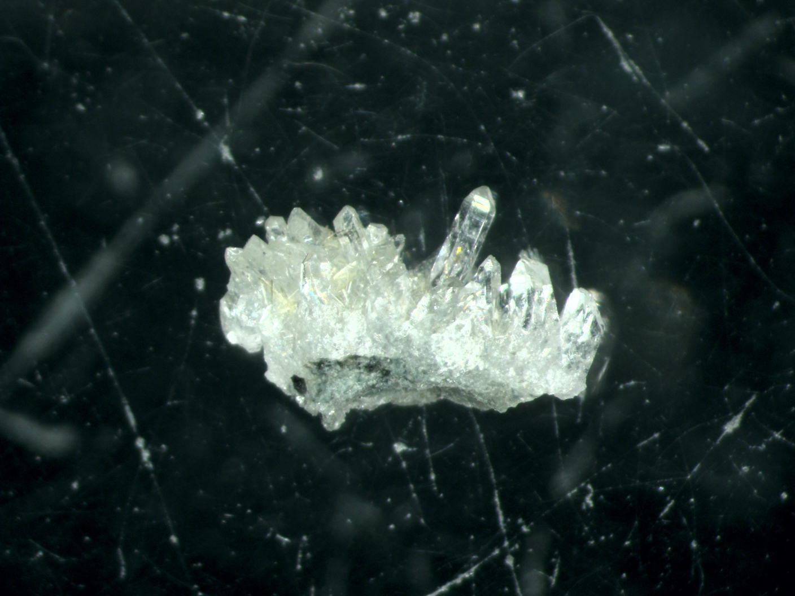

```{r pressure, echo=FALSE, out.width = '47%',fig.align="center"}
knitr::include_graphics("images/david_2.jpg")
```


## INTRO
Our environment is shaped by the reactions that occur at the interface between the hydrosphere, atmosphere, and silicate Earth. My endeavors involve developing novel approaches in isotope geochemistry to reconstruct environmental conditions through such reactions imprinted in the rock record. I like to think about the following questions: What is the connection between the evolution of continental crust and the long-term changes in climate? What are the feedbacks between seawater dissolved content, atmospheric chemistry and the rock cycle? What are the formations, minerals and isotope systems that offer proxies for unreacted seawater or local precipitation early in geologic history?

My work focuses on <b>O-isotope</b> geochemistry, including O-17, in Precambrian geology, magmatic-hydrothermal systems and alteration processes. I routinely measure δD, δ17O and δ18O in cherts, granites, and hydrothermally altered oceanic crust. Normally, I like to study old (Precambrian) rocks because there are fewer reliable environmental proxies, thus, the world is less constrained, and the approaches must be creative. I also enjoy studying modern environments, be it altered oceanic crust, hydrothermal vent fluids or a geothermal plant.


## PROJECTS

As a lead scientist, I have targeted:

`Paleoproterozoic snowball Earth glaciations, their timing and conditions`  
|    - [Surface temperatures and timing of melt-water infiltration during Snowball Earth glaciations](https://doi.org/10.1130/G38759.1)  
|    - [New occurrences across cratons, thier potential connections in the Paleoproterozoic based on O-isotopes](https://doi.org/10.1016/j.precamres.2019.105431)  
`Marine δ18O and solute chemistry in the Proterozoic`  
|    - [Seawater isotope value recorded in well-preserved 2.41 Ga altered basalts](https://doi.org/10.1016/j.gca.2019.01.014)  
|    - [Changes in altered oceanic crust in relation to evolving marine solutes 2.41 Ga](https://doi.org/10.1016/j.precamres.2021.106164)  
`Modern-day water-rock reactions traced with triple O:`  
|    - [O-17 signals of modern seawater/meteoric water - basalt reactions in Iceland with measurements of rocks and fluids](https://doi.org/10.1016/j.chemgeo.2019.119312)  
|    - [Modernd-day seawater-basalt exchange traced with the O-17 measurements of submarine vent fluids](https://doi.org/10.3389/feart.2021.691699)  
`Isotope record of seawater using in situ microscale and bulk 17O measurements of ancient and modern cherts:`  
|    - [Precambrian (and now modern) chert-forming fluids based on O-17 measurements and micrometer-scale heterogeneities](https://doi.org/10.2138/rmg.2021.86.10)  


`On-going projects` include using Secondary Ion Probe measurements of stable isotopes to answer questions in hydrothermal reactivity of seawater in oceanic crust, diagenetic maturation of cherts, triple O isotope geochemistry of terrestrial rocks, rock-water exchange experiments.

## SHORT BIO AND CV
```{r, echo=FALSE, out.width = '30%',out.extra='style="float:right; padding:10px"'}

```

I did my undergraduate degree at the Russian State Geological Prospecting University in Moscow studying general and economic geology with specific focus on geochemistry and mineralogy of ore deposits. I did my PhD at the University of Oregon under supervision of Ilya Bindeman. For my postdoctoral research, I am working at the SwissSIMS laboratory of the University of Lausanne. The analytical endeavors include laser fluorination, high-precision gas source mass spectrometery and secondary ion probe measurements. My field work has taken me to Russian Kola Peninsula and Karelia, Scottish Highlands and Iceland. See my <b>[CV](files/CV.pdf)</b>.

## PUBLICATIONS


```{r, echo=FALSE, results='asis',warning = FALSE}
library(knitr)
library(kableExtra)
knitr::kable(read.csv('files/publ.csv'))%>%
  kable_styling(font_size = 11)
```

## SIDE PROJECTS
A few projects conducted in my spare time are listed below:
<br>
<b>[Adularia](https://adularia.org/)</b>: A web-based application that calculates mineral formula based on EMPA analyses
<br>
<b>[A Shiny app](https://dzakharov.shinyapps.io/microprobe_imaging/)</b> that visualizes elemental maps in the Vetreny belt sample of hydrothermally altered komatiitic basalt (takes a while to load).
<br>
<b>[Oxygen isotope cheahsheet](https://opticalmineralogy.blogspot.com/2018/04/oxygen-isotopes-and-delta-notation.html?showComment=1571167305176#c5725660100796173008)</b> is a pdf/ppt file with oxygen isotope delta-notations, ranges, standardizations, fractionation factors, meteoric water cycle, etc.
